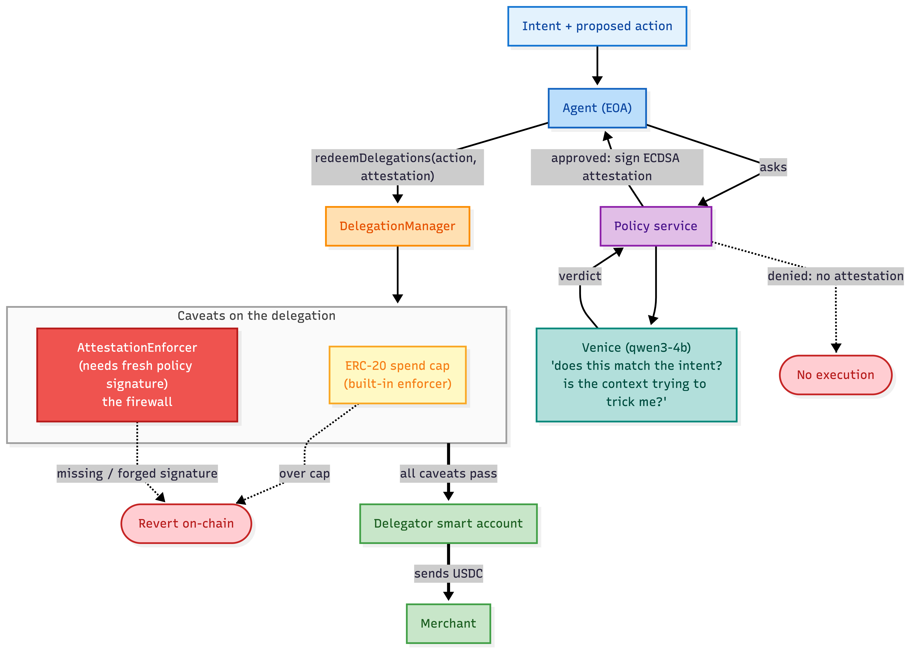

<p align="center">
  
</p>

<h1 align="center">Exequatur</h1>

<p align="center">A firewall for autonomous payment agents.</p>

## Why "Exequatur"

*Exequatur* is Latin for "let it be executed": an official authorization permitting an act to
proceed. An almost uncanny fit. Here, the policy's attestation is an exequatur for the agent's
action. No exequatur, no execution.

---

This is a firewall for AI payment agents.

The idea: you give an agent a scoped permission to spend your money (a MetaMask delegation with a
spend cap). But a cap alone doesn't stop a hijacked or prompt-injected agent from paying the wrong
person an amount that's technically "within the cap". So on top of the cap, every payment also has
to carry a fresh signature from a policy service that actually looks at the action and decides if it
matches what you asked for. That policy check runs through Venice. A custom caveat enforces the
signature on-chain, so the agent can't skip it.

If the agent goes rogue, the policy service just won't sign, and the on-chain redemption reverts.
Even if the agent forges its own signature, the enforcer checks it against the policy key baked into
the delegation and rejects it.

Status: live end to end, with a connected-wallet console (Next.js App Router) and a landing page,
both deployed. Built for the A2A coordination, Best Agent, and Best use of Venice tracks.

Live: app [app.exequatur.xyz](https://app.exequatur.xyz) · landing [exequatur.xyz](https://exequatur.xyz)

Demo video: [youtu.be/ltH6yTOqUtI](https://youtu.be/ltH6yTOqUtI) · Pitch deck: [exequatur.pdf](pitch/exequatur.pdf)

## How it works



The attestation is bound to the exact action (chain, delegation, target, amount, calldata, a nonce,
and an expiry), so a signature for one payment can't be reused for another. It's single use, keyed
per delegation, so replay doesn't work.

## Architecture

Three trust boundaries, layered so that compromising one doesn't open the gate.

**The grant (you sign once).** Your MetaMask smart account (the *delegator*) signs a single scoped
delegation to an agent EOA (the *delegate*): a spend cap (the Kit's ERC20TransferAmountEnforcer) plus
a custom **AttestationEnforcer** caveat pinned to a policy signer. In the console the connected wallet
is the signatory (ERC-7710), and deploy, gas, and funding are sponsored, so the user only signs once.

**The policy (off-chain decision).** Every proposed payment is screened (a sanctions / risk check on
the recipient) and then handed to a policy service that calls Venice with your plain-language intent,
the exact proposed action, and any untrusted context the agent saw (a seller's pitch, a pasted
email). Venice returns a structured verdict; on approve, the service signs an **attestation** bound to
the action (chain, delegation, target, amount, calldata, nonce, expiry). It fails closed: an error, a
timeout, or garbage output all mean deny.

**The enforcer (on-chain).** The agent redeems the delegation through the canonical DelegationManager.
The AttestationEnforcer recomputes the action hash and verifies the attestation against the policy key
baked into the caveat. No fresh, matching signature means the redemption reverts. The attestation is
single-use and keyed per delegation, so an old approval can't be replayed and one payment's signature
can't be reused for another.

**A2A.** The agent can redelegate a *narrower* cap to a worker EOA. Both hops carry the attestation
caveat, so the firewall gates the worker too, and a payment over the narrowed cap reverts on-chain.

**Revoke.** Revoking a delegation tells the policy to stop attesting it, so the next redemption
reverts at the enforcer (no fresh attestation). It is enforced on-chain and needs no bundler.

No bundler is used anywhere: the agent and worker are plain EOAs, so a redemption is an ordinary
transaction to the DelegationManager (the ERC-7710 wallet action), and only the delegator is a smart
account. The console keeps every private key and the policy server-side; the browser only builds and
signs the delegation with the user's wallet.

## Tracks (where to find each in the code)

We are submitting to three tracks. Everything runs through the MetaMask Smart Accounts Kit in the
main flow.

**Best Agent** — an autonomous agent you hand a budget to.
- Connect a wallet and sign one scoped delegation: [console/lib/grant.ts](console/lib/grant.ts)
  (`buildSmartAccount`, `signGrant`, via `toMetaMaskSmartAccount` + `createDelegation` +
  `signDelegation`), driven from [console/components/console/onboarding.tsx](console/components/console/onboarding.tsx).
- The agent proposes and pays in chat: the `pay` tool in
  [console/app/api/agent/route.ts](console/app/api/agent/route.ts) +
  [console/components/console/chat.tsx](console/components/console/chat.tsx).
- Each payment is an on-chain `DelegationManager.redeemDelegations`:
  [sdk/src/agent.ts](sdk/src/agent.ts) (`attemptPayment`), [sdk/src/delegation.ts](sdk/src/delegation.ts)
  (`redeem`), [sdk/src/console.ts](sdk/src/console.ts) (`redeemSignedDelegation`).

**Best A2A coordination** — redelegation.
- The agent redelegates a narrower cap to a worker: [sdk/src/delegation.ts](sdk/src/delegation.ts)
  (`createWorkerRedelegation`), [sdk/src/console.ts](sdk/src/console.ts) (`redelegateAndPay`), and the
  `redelegate` tool in [console/app/api/agent/route.ts](console/app/api/agent/route.ts).
- On-chain behaviour + tests: [contracts/test/Integration.t.sol](contracts/test/Integration.t.sol)
  (worker within the narrowed cap works, over it reverts, a broken chain reverts).

**Best use of Venice AI** — Venice is the decision that gates every payment.
- The Venice client (structured verdict, risk flags, fails closed): [sdk/src/venice.ts](sdk/src/venice.ts)
  (`makeVeniceBrain`), tested in [sdk/test/venice.test.ts](sdk/test/venice.test.ts).
- Its verdict is signed into the on-chain attestation: [sdk/src/policy-service.ts](sdk/src/policy-service.ts).
- Venice also powers the conversational agent: `createOpenAI({ baseURL: api.venice.ai })` in
  [console/app/api/agent/route.ts](console/app/api/agent/route.ts).

## What it protects against (and what it doesn't)

Protects against:
- an agent that gets hijacked or prompt-injected and tries to pay outside your intent or scope
- a malicious sub-agent you redelegated to
- replaying an old approval

Does not protect against:
- you signing a bad root delegation in the first place
- the policy service's signing key getting compromised
- the merchant themselves being malicious

I'd rather state the boundary honestly than claim it stops everything.

## Layout

```
contracts/   Foundry. MockUSDC + the AttestationEnforcer caveat + tests. Runs offline.
sdk/         TypeScript. The real create/sign/redeem flow on the MetaMask Smart Accounts Kit,
             the policy service, the Venice client, and the end-to-end runner.
console/     Next.js console (App Router). Connect a wallet, grant a scoped delegation, then chat
             with the agent; every payment runs the firewall live. Consumes the SDK (pnpm workspace).
landing/     Next.js landing page (TypeScript, three.js shader hero). See landing/README.md.
```

The contracts use MetaMask's audited Delegation Framework v1.3.0 (installed via
`contracts/install-deps.sh`, not vendored). The SDK uses `@metamask/smart-accounts-kit`, which is the
package that used to be called the Delegation Toolkit.

The one thing that has to match exactly between the two sides is the action hash that the policy
signs and the enforcer rebuilds. If those ever drift, every signature check fails for confusing
reasons, so it's defined identically in [sdk/src/actionHash.ts](sdk/src/actionHash.ts) and
[AttestationEnforcer.computeActionHash](contracts/src/AttestationEnforcer.sol), and pinned by a
golden-vector test on both sides
([contracts/test/ActionHashParity.t.sol](contracts/test/ActionHashParity.t.sol) and
[sdk/test/actionHash.test.ts](sdk/test/actionHash.test.ts)).

## Tests

Foundry, 16 tests, fully offline (`cd contracts && forge test`):
- the enforcer on its own: valid attestation, missing, wrong signer, expired, replayed, tampered
  action, per-delegation replay keying, bad terms length
- the real `DelegationManager.redeemDelegations` flow: happy path, over the cap, and within the cap
  but not approved by the policy
- A2A redelegation: worker within the narrowed cap works, over it reverts, and a broken chain reverts
- the action-hash golden vector

SDK unit tests, 13 tests, offline (`cd sdk && pnpm test`):
- the action hash and that it changes when any bound field changes
- the policy service approving/denying and the attestation recovering to the right signer
- the Venice client against a mocked transport: the request shape, parsing, failing closed on
  errors/timeouts/garbage output, and pulling the verdict out of a reasoning model's response

End-to-end, 6 scenarios, against a Base Sepolia fork or real Base Sepolia:
- happy path, the firewall refusing an off-intent payment, a forged attestation getting rejected
  on-chain, the A2A worker paying within its narrower scope, and the worker getting reverted when it
  goes over that scope

### Live on Base Sepolia (real Venice, qwen3-6-27b)

The deployed console ([app.exequatur.xyz](https://app.exequatur.xyz)) runs against pinned,
deploy-once fixtures (`sdk/src/config.ts`); the canonical DelegationManager comes from the Smart
Accounts Kit:

| | on Base Sepolia |
|---|---|
| AttestationEnforcer (the firewall caveat) | [0xF16c...253c9](https://sepolia.basescan.org/address/0xf16c36b6c2a3b539074f56697947a8d931d253c9) |
| MockUSDC | [0xb04e...235DD](https://sepolia.basescan.org/address/0xb04e3063545f6a8658a0421c66fa3977ae3235dd) |
| a payment cleared through the firewall | [tx 0x159580fc](https://sepolia.basescan.org/tx/0x159580fc3005f7e75c47bd11e8b0437c907eb70746f8692f3944c70f76d904c2) |

On the attack scenario, Venice denies it on its own and flags `prompt_injection`, `intent_mismatch`,
`amount_exceeds_intent`, and `unknown_recipient`. The forged-attestation and over-cap scenarios
revert before any money moves, so there's nothing to see on the explorer for those beyond the failure.

## Running it

```bash
# 1. the contract tests (offline, no keys needed)
cd contracts && ./install-deps.sh && forge test -vvv

# 2. the SDK unit tests (offline)
cd sdk && pnpm install && pnpm test

# 3. the full end-to-end against a Base Sepolia fork.
#    needs anvil (Foundry) and pnpm. it starts and stops the fork for you,
#    generates fresh keys, and funds them on the fork, so no secrets are needed.
cd sdk && ./run-e2e.sh

# 4. or run it against real Base Sepolia: drop a funded key into sdk/.env as PRIVATE_KEY.
#    it deploys the contracts, sends a little gas to fresh agent/worker accounts, and submits
#    real transactions.
cd sdk && pnpm e2e
```

By default the policy uses a deterministic stub so the tests are reproducible and don't need a
network. To use real Venice, put `VENICE_API_KEY` in `sdk/.env` (and optionally `VENICE_MODEL`; the
console uses `qwen3-6-27b`, which is far more reliable than the small `qwen3-4b` default). See
[.env.example](.env.example). The Venice call is the real decision: it reads
your plain-language intent plus the proposed action and the untrusted context the agent saw, and it
fails closed, so an error, a timeout, or garbage output all mean "deny" and nothing moves. The
account needs inference credits or you'll get a 402 and every payment is refused.

## A couple of things worth knowing

No bundler is used anywhere. The agent and worker are plain EOAs, so redeeming a delegation is just a
normal transaction to the DelegationManager (via the ERC-7710 wallet action). Only the funded
delegator is a smart account.

The e2e generates fresh keys each run instead of using the well-known Anvil dev keys. Those famous
test addresses already have EIP-7702 delegations sitting on real Base Sepolia, which makes the
DelegationManager treat an EOA redelegator as a contract and breaks the A2A chain. Took a while to
figure out, so it's worth flagging.
